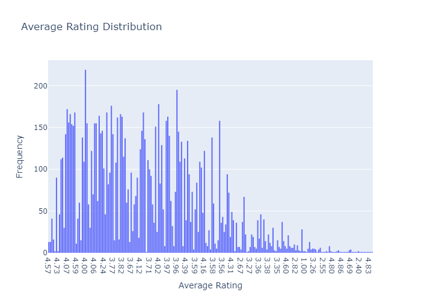
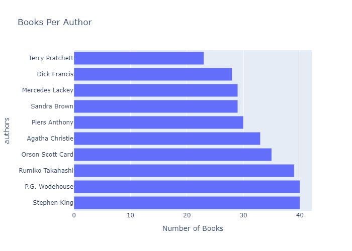

# book-recommender-system

A content-based book recommendation system that suggests similar books based on title and author using **TF-IDF vectorization** and **cosine similarity**. The project also includes interactive visualizations with **Plotly** to explore the dataset.

---

## 🚀 Features

- Recommends similar books based on content (title + author)
- Uses `TfidfVectorizer` and cosine similarity from `sklearn`
- Visualizes rating distributions and top authors using Plotly
- Clean and modular code for easy understanding

---

## 📊 Demo Visualizations

### ⭐ Average Rating Distribution

### ✍️ Top Authors by Book Count

---

## 🧠 How It Works

1. Combines `title` and `author` into a single feature for vectorization
2. Converts book content to TF-IDF vectors
3. Computes cosine similarity between all books
4. Finds the top 10 most similar books based on cosine score

